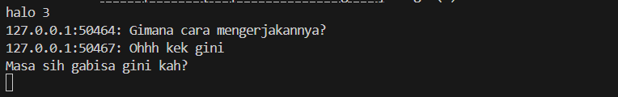

## Server


## Client 1


## Client 2


## Client 3


## Server (client leave)


## Client (Server down)


# Cara Menjalankan Program Chat WebSocket

## Langkah-langkah Menjalankan

1. **Kompilasi kedua program**:
   ```
   cargo build --bin server
   cargo build --bin client
   ```

2. **Jalankan server** di terminal pertama:
   ```
   cargo run --bin server
   ```
   Anda akan melihat pesan: `listening on port 2000`

3. **Jalankan beberapa client** di terminal terpisah:
   ```
   cargo run --bin client
   ```
   Lakukan ini di 2-3 terminal berbeda untuk mensimulasikan beberapa pengguna

## Apa yang Terjadi Saat Mengetik Pesan

1. **Koneksi Client**: Saat client baru terhubung, server akan menampilkan pesan `New connection from 127.0.0.1:XXXXX` di terminalnya, menunjukkan koneksi baru berhasil.

2. **Mengirim Pesan**: 
   - Ketika Anda mengetik pesan di salah satu terminal client dan menekan Enter, pesan tersebut dikirim ke server.
   - Server mencatat pesan yang diterima dengan mencetak `Received from 127.0.0.1:XXXXX: [pesan]`
   - Server kemudian mem-broadcast pesan tersebut ke semua client lain (tidak termasuk pengirim).

3. **Menerima Pesan**:
   - Client lain akan menerima pesan yang di-broadcast dan menampilkannya di terminal mereka dengan format `127.0.0.1:XXXXX: [pesan]`, menunjukkan alamat pengirim dan pesan yang dikirim.
   - Pengirim tidak menerima pesan mereka sendiri kembali karena kita memfilternya di server.

4. **Real-Time Communication**: 
   - Semua komunikasi terjadi secara real-time berkat websocket
   - Client tidak perlu melakukan polling atau refresh untuk menerima pesan baru

5. **Penutupan Koneksi**:
   - Jika client menutup koneksi (dengan Ctrl+C atau Ctrl+D), server akan mendeteksi penutupan dan menampilkan pesan `Client 127.0.0.1:XXXXX disconnected`
   - Client lain tetap dapat berkomunikasi tanpa gangguan

# Cara Memodifikasi Port WebSocket ke 8080

## Perubahan yang Dilakukan

Untuk mengubah port websocket dari 2000 menjadi 8080, saya perlu memodifikasi dua file:

### 1. Di server.rs

```rust
// Sebelumnya
let listener = TcpListener::bind("127.0.0.1:2000").await?;
println!("listening on port 2000");

// Diubah menjadi
let listener = TcpListener::bind("127.0.0.1:8080").await?;
println!("listening on port 8080");
```

### 2. Di client.rs

```rust
// Sebelumnya
let (mut ws_stream, _) =
    ClientBuilder::from_uri(Uri::from_static("ws://127.0.0.1:2000"))
        .connect()
        .await?;

// Diubah menjadi
let (mut ws_stream, _) =
    ClientBuilder::from_uri(Uri::from_static("ws://127.0.0.1:8080"))
        .connect()
        .await?;
```

## Protokol WebSocket

Dalam implementasi ini, kedua sisi (server dan client) menggunakan protokol WebSocket yang sama:

1. **Server Side**: Menggunakan `tokio_websockets::ServerBuilder` untuk menerima koneksi WebSocket pada port 8080.

2. **Client Side**: Menggunakan `tokio_websockets::ClientBuilder` untuk terhubung ke server WebSocket di alamat `ws://127.0.0.1:8080`.

Protokol WebSocket ditentukan dengan prefix `ws://` pada URI yang digunakan client. Ini menunjukkan bahwa koneksi akan menggunakan protokol WebSocket standar (bukan HTTPS/WSS).

## Cara Kerja Koneksi WebSocket

1. **Protokol Handshake**: Koneksi WebSocket dimulai dengan HTTP handshake, kemudian ditingkatkan ke koneksi persisten.

2. **Alamat Definisi**: 
   - Di server: Protokol didefinisikan implisit saat menerima koneksi TCP dan meng-upgrade-nya menggunakan `ServerBuilder::accept()`
   - Di client: Protokol didefinisikan eksplisit dengan URI format `ws://host:port`

3. **Kompatibilitas**: Kedua sisi harus menggunakan port yang sama (8080) agar bisa berkomunikasi.
